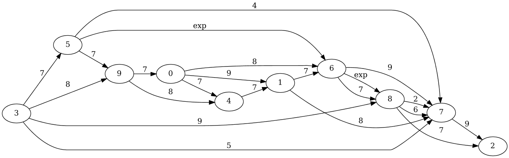
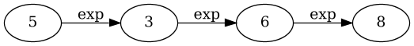
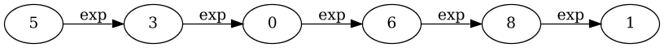
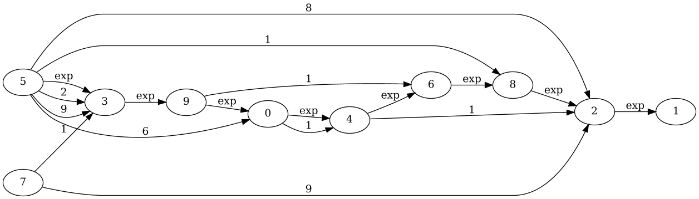
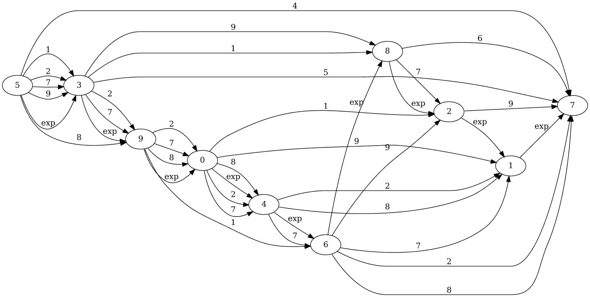

# Example run

Scenarion parameters

* Random seed: `1`
* Scenario name: `Transitive`
* Run duration: `10`
* Number of agents: `10`
* Interaction density: `1.0`
* Everything else is left to default

## Tick 1

### Experiences

### Opinions

### Trust

## Tick 2

### Experiences

### Opinions

### Trust

## Tick 3

### Experiences

### Opinions

### Trust

## Tick 4

### Experiences

### Opinions

### Trust

## Tick 5

### Experiences

### Opinions

### Trust

## Tick 6

### Experiences

### Opinions

### Trust

## Tick 7

### Experiences

### Opinions

### Trust

## Tick 8

### Experiences

### Opinions

### Trust

## Tick 9

### Experiences

### Opinions

### Trust

## Tick 10

### Experiences

### Opinions

### Trust
