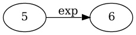
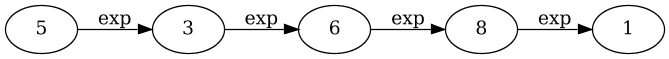
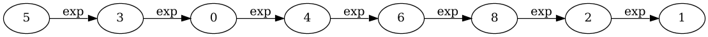
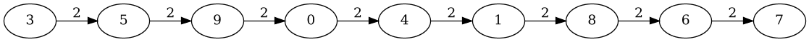

# A description of events during an example run

The document describes what is actually going on during an evaluation run: what kind of data the trust model is given and how it computes trust.

## Evaluation overview

In every tick, ATB generates data (simulates creation of experiences and opinions) and hands it to the trust model that is being evaluated. The model then converts (or translates) the data into a format that it finds appropriate. Using the converted data, the model estimates trust and hands it to the ATB. Finally, the testbed evaluates the correctnes of computed trust by comparing estimations to the ground-truth.

Ground truth is what determines how agents behave in interactions and how truthfully they provide opinions. In ATB, ground truth is denoted with `capabilities`. While there are many aspects to modeling agents, for a simple explanation cosider the following cases:

* A low capability agent denotes an agent that is both 1) bad at behaving in interactions and 2) very untrustworthy at providing opinions (it lies most of the time). 
* In contrast, a high capability agent is 1) good at behaving in interactions and 2) trustworthy at providing opinions (most of the time it provides truthful opinions).
* An agent whose capability is somewhere around the middle (say `0.50`) 1) performs so-so in interactions and 2) provides honest opinions about `50%` of the time. 

(Also, keep in mind that _noise_ is also introduced into the process of generating experiences and opinions: it can happen (but with lower probability) that an agent with good capability can perform poorly or the other way around.)

In this evaluation scenario, the capabilities are the following (integers denote agents, and floats thier capabilities): `(5, 0.09), (3, 0.11), (9, 0.24), (0, 0.45), (4, 0.50), (1, 0.72), (6, 0.75), (8, 0.81), (2, 0.97), (7, 0.99)`. Also, the capabilities are static -- they do not change with time.

So the trust model should produce the following order to get a perfect score: `5 -> 3 -> 9 -> 0 -> 4 -> 1 -> 6 -> 8 -> 2 -> 7`.

## Trust model based on credibility orders

The first iteration of the model is implemented as we discussed it:

1. As the testbed generates experiences, we convert them into a knowledge-base based solely on experiences.
2. Then as we obtain opinions (that is, we get a knowledge-base from every agent in the system) we merge them to the knowledge-base of experiences. In doing so, we give the highest credibility to credibility objects that were created from experiences (because experiences are the most reliable pieces of information).
3. When submitting trust, we submit the transitive-closure over the final knowledge-base.

## Scenario parameters

In order to produce repeatable evaluation results, we have to be aware of the evaluation parameters.

* Random seed: `1`;
* Scenario name: `Transitive`;
* Run duration: `10`;
* Number of agents: `10`;
* Interaction density: `1.0` -- means that our agent (Alpha) gets to eventually interact with every agent in the system;
* Everything else is left to default.

## An example run

The text and images below denote the knowledge-bases of experiences, received opinions and merged knowledge-bases at every tick of a 10-tick evaluation run. To recall:

* The actual capabilities of agents: `(5, 0.09), (3, 0.11), (9, 0.24), (0, 0.45), (4, 0.50), (1, 0.72), (6, 0.75), (8, 0.81), (2, 0.97), (7, 0.99)`;
* The perfect score: `5 -> 3 -> 9 -> 0 -> 4 -> 1 -> 6 -> 8 -> 2 -> 7`.

### Tick 1

#### Experiences

Received experiences `[(6, 0.67)]`.

The list of all so far obtained experiences: `[(6, 0.67)]`.

Knowledge-base of experiences:

(cannot create a KB from a single experience)

#### Opinions

Knowledge-bases of received opinions (each row is acually its own knowledge-base):

#### Trust

Merged knowledge-base of experiences and all received knowledge-bases of opinions:

### Tick 2

#### Experiences
Received experiences `[(5, 0.14)]`.

The list of all so far obtained experiences: `[(5, 0.14), (6, 0.67)]`.

Knowledge-base of experiences:

#### Opinions

Knowledge-bases of received opinions (each row is acually its own knowledge-base):

#### Trust

Merged knowledge-base of experiences and all received knowledge-bases of opinions:

### Tick 3

#### Experiences
Received experiences `[(8, 0.74)]`.

The list of all so far obtained experiences: `[(5, 0.14), (6, 0.67), (8, 0.74)]`.

Knowledge-base of experiences:

#### Opinions

Knowledge-bases of received opinions (each row is acually its own knowledge-base):

#### Trust

Merged knowledge-base of experiences and all received knowledge-bases of opinions:

### Tick 4

#### Experiences

Received experiences `[(3, 0.20)]`.

The list of all so far obtained experiences: `[(5, 0.14), (3, 0.20), (6, 0.67), (8, 0.74)]`.

Knowledge-base of experiences:

#### Opinions

Knowledge-bases of received opinions (each row is acually its own knowledge-base):

#### Trust

Merged knowledge-base of experiences and all received knowledge-bases of opinions:

### Tick 5

#### Experiences

Received experiences `[(1, 0.93)]`.

The list of all so far obtained experiences: `[(5, 0.14), (3, 0.20), (6, 0.67), (8, 0.74), (1, 0.93)]`.

Knowledge-base of experiences:

#### Opinions

Knowledge-bases of received opinions (each row is acually its own knowledge-base):

#### Trust

Merged knowledge-base of experiences and all received knowledge-bases of opinions:

### Tick 6

#### Experiences

Received experiences `[(0, 0.44)]`.

The list of all so far obtained experiences: `[(5, 0.14), (3, 0.20), (0, 0.44), (6, 0.67), (8, 0.74), (1, 0.93)]`.

Knowledge-base of experiences:

#### Opinions

Knowledge-bases of received opinions (each row is acually its own knowledge-base):

#### Trust

Merged knowledge-base of experiences and all received knowledge-bases of opinions:

### Tick 7

#### Experiences

Received experiences `[(4, 0.61)]`.

The list of all so far obtained experiences: `[(5, 0.14), (3, 0.20), (0, 0.44), (4, 0.61), (6, 0.67), (8, 0.74), (1, 0.93)]`.

Knowledge-base of experiences:

#### Opinions

Knowledge-bases of received opinions (each row is acually its own knowledge-base):

#### Trust

Merged knowledge-base of experiences and all received knowledge-bases of opinions:

### Tick 8

#### Experiences

Received experiences `[(2, 0.89)]`.

The list of all so far obtained experiences: `[(5, 0.14), (3, 0.20), (0, 0.44), (4, 0.61), (6, 0.67), (8, 0.74), (2, 0.89), (1, 0.93)]`.

Knowledge-base of experiences:

#### Opinions

Knowledge-bases of received opinions (each row is acually its own knowledge-base):

#### Trust

Merged knowledge-base of experiences and all received knowledge-bases of opinions:

### Tick 9

#### Experiences

Received experiences `[(9, 0.24)]`.

The list of all so far obtained experiences: `[(5, 0.14), (3, 0.20), (9, 0.24), (0, 0.44), (4, 0.61), (6, 0.67), (8, 0.74), (2, 0.89), (1, 0.93)]`.

Knowledge-base of experiences:

#### Opinions

Knowledge-bases of received opinions (each row is acually its own knowledge-base):

#### Trust

Merged knowledge-base of experiences and all received knowledge-bases of opinions:

### Tick 10

#### Experiences

Received experiences `[(7, 0.96)]`.

The list of all so far obtained experiences: `[(5, 0.14), (3, 0.20), (9, 0.24), (0, 0.44), (4, 0.61), (6, 0.67), (8, 0.74), (2, 0.89), (1, 0.93), (7, 0.96)]`.

Knowledge-base of experiences:

#### Opinions

Knowledge-bases of received opinions (each row is acually its own knowledge-base):

#### Trust

Merged knowledge-base of experiences and all received knowledge-bases of opinions:

## Some issues

* The order in which we merge the knowledge-base with received opinios is important: the end result changes if we werge knowledge-bases of agents in a different order -- say `0-9` or `9-0`. This is something we have to address.
* When the number of agents increases (even to 20), the performance decreases beyond reason. The issue is graph merging: as the number of agents increases, so does the number of opinions, and consequently the number of loops that are created during graph merge. Enumerating all of them simply takes too long.
* Metrics: as it currently stands, we're using the Kendall's Tau-A metric, which is normally used to compare total orders. However we can apply it to partial order as well. Semantically this means that in cases where two agents are incomparable, the metric behaves as if they were omitted from the total ranking. I think that, currently, this is still fine, because, currently, the ground-truth (capabilities) actually has total order -- and if the submitted ranking has only partial order, this means that in that in the incomparable part, the trust model failed to estimate the trust accurately.

  I have some ideas on how to proceed here, but I'll leave that for later. (Interestingly, my ideas were quite similart to what can be found in the literature, for instance: [Malmi et al. Beyond rankings: comparing directed acyclic graphs. Data Mining and Knowledge Discovery, 2015](https://link.springer.com/article/10.1007%2Fs10618-015-0406-1).)